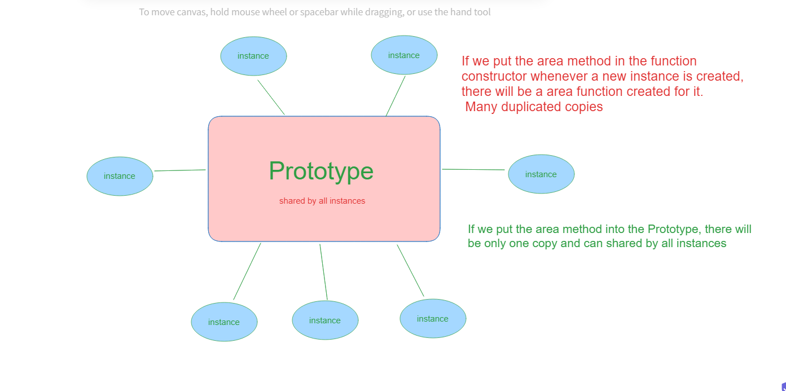
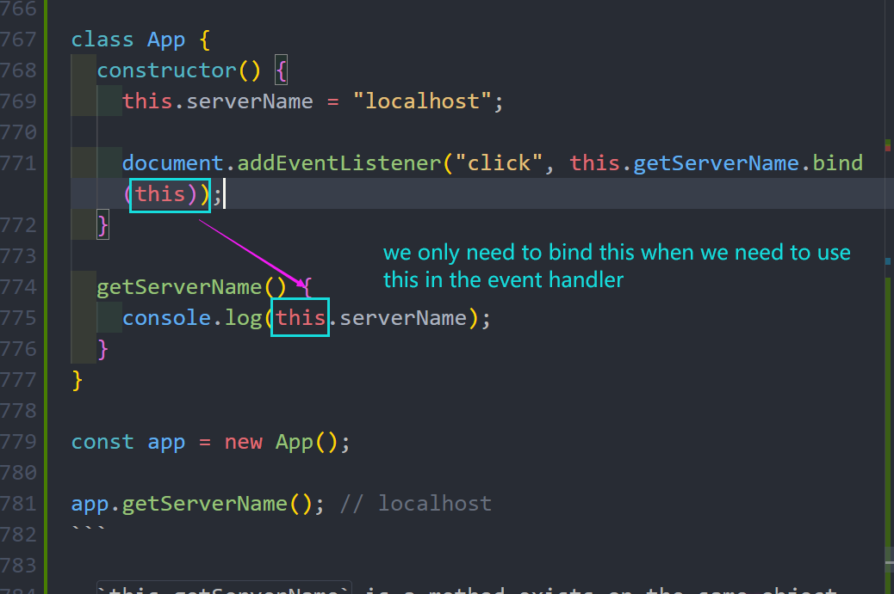
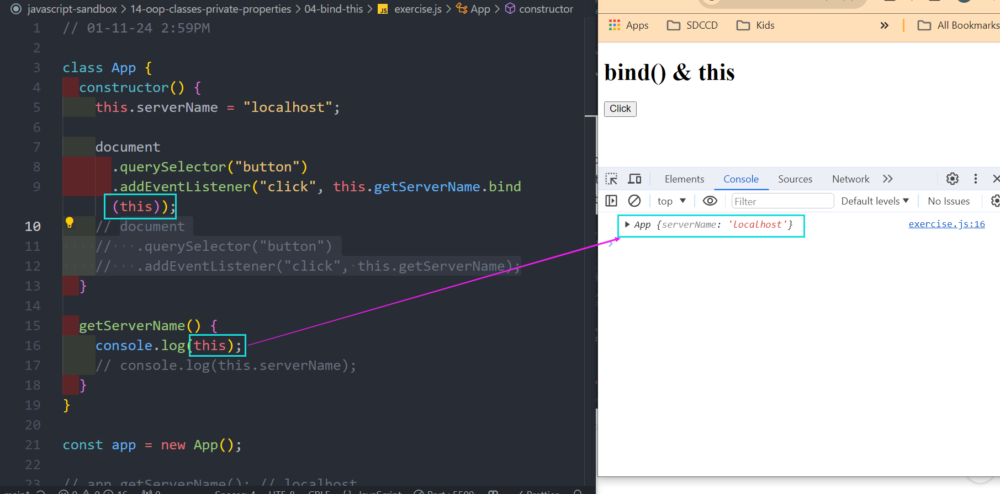

# Modern JavaScript From The Beginning 2.0 - Brad Traversy

## Section 4: Functions, Scopes & Execution Context

### Execution Context

- Execution context is the environment in which JavaScript code is executed. It consists of the variable environment, the scope chain, and the `this` keyword.
- When you run any JavaScript code, a special environment is created to handle the transformation and execution of code. This is called the execution context. It contains the currently running code and everything that aids in its execution.

#### Execution Context Phases

- Memory Creation Phase
  - Create the global object(browser = window, node = global)
  - Create the `this` object and bind it to the global object.(can check `this` in the console, same as window in the browser)
  - Setup memory heap for storing variables and function references
  - Store functions and variables in global execution context and set to "undefined"
- Execution Phase
  - Execute code line by line
  - Create a new execution context for each function call(nested execution context)

Example: (refer to notion notes for pictures)

## Section 10: Asynchronous JavaScript

### Promises

- Most of the time we deal with the response from a promise, not writing them. For example, we use `fetch` to get data from an API and it returns a promise. We need to know what to do with the promise and how to handle it.
- We use `new Promise` to create a promise. It takes in a function with two parameters: `resolve` and `reject`. Inside the function, we perform the asynchronous operation. If the operation is successful, we call `resolve` and pass in the data. If the operation fails, we call `reject` and pass in the error.

```javascript
const promise = new Promise((resolve, reject) => {
  // simulate doing some async task
  const success = Math.random() > 0.5;
  setTimeout(() => {
    if (success) {
      resolve({ name: "John", title: "CEO" });
    } else {
      reject("Something wrong and I can not get the data!");
    }
  }, 1000);
});

promise
  .then((user) => {
    console.log("successfully get the data", user);
  })
  .catch((err) => console.log(err));

console.log("Hello from the global scope");
```

- `setTimeout(callback, time)` is the function that you invoke to register your callback function and specify under what asynchronous conditions it should be invoked.

### Promises vs Callback Hell

## Section 14: OOP - Constructors & Prototypes

### What is OOP?

#### Components of OOP

- Constructor Functions(JS): Creates a blueprint for an object
- Prototypes(JS): a way for objects to inherit properties and methods from anther object
- Classes: Another way to create a blueprint. Introduced in ES6 and it is just syntactic sugar over constructor functions and prototypes. This is different from classes in other languages like Java or C++.
- Instances: Objects created from a blueprint(constructor function or class)

#### 4 Principles of OOP

- Abstraction: Hiding all but the relevant parts of an object in order to reduce complexity and increase efficiency. For example, we don't need to know how a car works to drive it.
  - When we use fetch() or we create an event listener, we don't need to know how it works. We just need to know how to use it.
  - When we look at a public API, we don't know how it works internally or what goes on on the server, we just hit the endpoint and get the data.
  - Reduce complexity and isolate impact of changes. For example, if we change the implementation of a function, we don't need to change the code that uses it.
- Encapsulation: The process of wrapping up data and methods into a unit such as a class or a function. Encapsulation usually includes some kind of data hiding. For example, we can use private variables and methods to hide implementation details. Think about scope and closures in JS, we cannot access variables inside a function from outside.
- Inheritance: The process of inheriting properties and methods from a parent class or constructor. For example, we can create a class called Person and then create another class called Customer that inherits from Person. Customer will have all the properties and methods of Person.
- Polymorphism: The process of changing or overriding methods inherited from a parent class. For example, we can have a method called `getDetails()` in Person and then override it in Customer.

### Object Literals and `this` keyword

- `this` keyword refers to the current instance of the object. It is a reference to the current object.
- The value of `this` is determined by how a function is called. It can be called in four ways:
  - Method: `this` refers to **the object** that the method belongs to. For example, `person.getDetails()` `this` refers to `person`.
  - Function: `this` refers to the global object. In the browser, it is the window object. In node, it is the global object.
  - Constructor: `this` refers to the instance of the object that is created by the constructor.
  - Call and Apply: `this` refers to the first argument passed to `call` or `apply`.
- Object literals means creating an object using `{}`. We can use object literals to create a single object. We can create a method inside the object literal also like the `area` method in the following example.

  ```javascript

  const rectangle = {
  name: "Rectangle 1",
  width: 10,
  height: 10,
  area: function () {
    return this.width * this.height;
  },
  };

  ```

- The disadvantage of object literals is that we cannot create multiple objects with the same properties and methods. For example, if we want to create another rectangle, we have to copy and paste the code and change the values. This is not efficient and not scalable.
- We can use constructor functions to create a blueprint for an object.

### Constructor Functions

- Constructor functions are functions that create objects. We can use `new` keyword to create an instance of an object. When we use `new` keyword, it does four things:
  - Creates a new empty object
  - The constructor function is called with the arguments that we passed in
  - The `this` keyword is set to the new object
  - The new object is returned from the constructor function

```javascript
function Rectangle(name, width, height) {
  this.width = width;
  this.height = height;
  this.name = name;
  this.area = function () {
    return this.width * this.height;
  };
}

const rect1 = new Rectangle("rect1", 30, 40);
console.log(rect1.area());
console.log(rect1 instanceof Rectangle);
console.log(rect1.constructor);

```

- We first create a constructor function called `Rectangle`. It's a convention to capitalize the first letter of a constructor function.
- We pass in three parameters: `name`, `width`, and `height`. Inside the constructor function, we use `this` keyword to set the properties of the object. We also create a method called `area` inside the constructor function. - We use `new` keyword to create an instance. We pass in the arguments to the constructor function. We can access the properties and methods of the object using dot notation.
- We can use `instanceof` to check if an object is an instance of a constructor function. We can use `constructor` to check the constructor of an object.

### Literals vs Built-in Constructors

- When we use a property of method of an object, JS engine first looks for the property or method in the object itself. If it cannot find it, it looks for it in the prototype of the object. If it cannot find it in the prototype, it looks for it in the prototype of the parent object. This is called the prototype chain. The prototype chain is used to implement inheritance in JS.

```javascript
// 1-10-24

// strLit is literal
const strLit = "Hello";
// strObj is an object
const strObj = new String("Hello");

console.log(strLit, typeof strLit); // hello string
console.log(strObj, typeof strObj); // [String: 'Hello'] object

// Boxing: literal to object
console.log(strLit.toUpperCase()); // HELLO
console.log(strLit[0]); // H

// Unboxing: object to literal
console.log(strObj.valueOf(), typeof strObj.valueOf()); // valueOf is the Object's prototype(inherited)

// constructor
console.log(strLit.constructor); // same constructor function returned
console.log(strObj.constructor); // same constructor function returned

// instance
console.log(strLit instanceof String); // false
console.log(strObj instanceof String); // true

// Other types Number, Boolean, Array

const numLit = 20;
const numObj = new Number(20);

console.log(numLit, typeof numLit); // 20 number
console.log(numObj, typeof numObj); //[Number: 20] object

const boolLit = true;
const boolObj = new Boolean(true);

console.log(boolLit, typeof boolLit); // true boolean
console.log(boolObj, typeof boolObj); // [Boolean: true] object

const arrLit = [1, 2, 3, 4, 5]; // object
const arrObj = new Array(1, 2, 3, 4, 5); //object
console.log(arrLit, typeof arrLit); // same
console.log(arrObj, typeof arrObj); //same

// weird stuff

const funcLit = function (x) {
  return x * x;
};

console.log(funcLit, typeof funcLit); // [Function: funcLit] function
console.log(funcLit(10)); // 100

const funcObj = new Function("x", "return x * x"); // create a function
console.log(funcObj(8)); // 64

// both ways are the same to create a Object instance
const obj1 = {};
const obj2 = new Object();
console.log(obj1, typeof obj1); // {} object
console.log(obj2, typeof obj2); // {} object
```

- `valueOf()` is a method that returns the primitive value of the object. It is inside the prototype of the object. When we call `strObj.valueOf()`, the JS engine first looks for `valueOf()` in the object itself. Since it cannot find it, it looks for it in the prototype of the object and this is where it finds it. It then calls `valueOf()` and returns the primitive value of the object.
- When creating a string, number, or boolean using literals, when we check the type, it returns the primitive type. When we create a string, number, or boolean using the constructor, when we check the type, it returns object. Arrays are always objects.

### Working With Object Properties

- We can use dot notation or bracket notation to access properties of an object. We can also use bracket notation to access properties dynamically. For example, we can use a variable to access a property of an object.
- We can add properties to an object using dot notation or bracket notation. We can also add properties dynamically using bracket notation.
- We can add methods to an object.
- We can delete properties using `delete` keyword. We can also use `delete` keyword to delete methods.
- We can check if an object has a property using `hasOwnProperty()` method. It returns `true` if the object has the property and `false` if it doesn't.
- We can get all the keys of an object using `Object.keys()` method. It returns an array of all the keys of the object.
- We can get all values of an object using `Object.values()` and all entries of an object using `Object.entries()`. We can also filter out the methods of an object using `Object.entries()` and `typeof` operator `typeof value !== "function"`

```javascript

function Rectangle(name, width, height) {
  this.width = width;
  this.height = height;
  this.name = name;
  this.area = function () {
    return this.width * this.height;
  };
}

// create an instance
const rect1 = new Rectangle("Rectangle 1", 10, 10);
const rect2 = new Rectangle("Rectangle 2", 20, 20);

// access properties
console.log(rect1.name, rect1.width); // 1 10
console.log(rect2["width"]); // 20

// add a property color
rect1.color = "red";

// add a method perimeter
rect2.perimeter = () => 2 * (rect2.width + rect2.height); // 80
console.log(rect2.perimeter());

// check the instances with new added method and property
console.log(rect1);
console.log(rect2);

// delete a property
delete rect2.perimeter;
console.log(rect2);

// check property
console.log(rect2.hasOwnProperty("color")); // false
console.log(rect1.hasOwnProperty("color")); // true

// get keys
console.log(Object.keys(rect1)); // [ 'width', 'height', 'name', 'area', 'color' ]

//get values
console.log(Object.values(rect2)); // [ 20, 20, 'Rectangle 2', [Function (anonymous)] ]

// get entries

console.log(Object.entries(rect1));

for (let [key, value] of Object.entries(rect1)) {
  if (typeof value !== "function") {
    console.log(`${key} : ${value}`); // only log the properties
  }
}

```

### Prototypes

- Prototype is a special object where additional properties and methods can be attached and shared among all instances of its constructor function.
- Every JavaScript object has a prototype. The prototype is also an object. The Object.prototype is on the top of the prototype chain.
- The reason why you always see `Object.prototype` at the end of the prototype chain is because Object.prototype is the end of the prototype chain. In JavaScript, `Object.prototype` is the only object that doesn't have a prototype. It provides properties and methods that **are common to all objects**, which is why they are available to any object you create.
- This is part of JavaScript's inheritance model. When you try to access a property or method of an object, JavaScript will first look at the object's own properties. If it doesn't find it there, it will look at the properties of the object's prototype, and so on up the prototype chain, until it gets to Object.prototype. If the property or method isn't found there, `undefined` is returned.
- When we create a new object using a constructor function, the object has access to all the properties and methods defined in the constructor prototype.
- We can use `Object.getPrototypeOf()` to get the prototype of an object. We can also use `__proto__` to get the prototype of an object. We can use `Object.getPrototypeOf()` to set the prototype of an object. We can also use `__proto__` to set the prototype of an object.

```javascript
function Rectangle(name, width, height) {
  this.name = name;
  this.width = width;
  this.height = height;
  this.area = function () {
    return this.width * this.height;
  };
}
// Object literal
const user = {
  name: "jack",
  age: 22,
};

const rect = new Rectangle("Rect", 10, 10);
console.log(user instanceof Object); // true
console.log(rect instanceof Object); // true

console.log(rect);

 // Rectangle.prototype inherits from Object.prototype. That's why we can use toString(), valueOf(), etc
console.log(rect.toString());

// To get the prototype of an object, both ways are the same
console.log(Object.getPrototypeOf(rect));
console.log(rect.__proto__); //same as above

```

- The `area()` function of the Rectangle constructor is always the same and it is not efficient to create it for every instance. We can move it to the prototype of the constructor so that all instances can share it and there is only one copy of it, rather than being duplicated for each instance. This can save memory and improve performance.

### Adding Methods to Prototypes



- We can add methods to the prototype of a constructor function. Let's try to move the `area()` method to the prototype of the Rectangle constructor.

```javascript

function Rectangle(name, width, height) {
  this.name = name;
  this.width = width;
  this.height = height;
}

Rectangle.prototype.area = function () {
  return this.width * this.height;
};

const rect = new Rectangle("Rect", 10, 10);
console.log(rect);
console.log(rect.area());

```

- We can add more functions to the prototype of the Rectangle constructor and all instances will have access to them.

```javascript
function Rectangle(name, width, height) {
  this.name = name;
  this.width = width;
  this.height = height;
}

Rectangle.prototype.area = function () {
  return this.width * this.height;
};

Rectangle.prototype.perimeter = function () {
  return 2 * (this.width + this.height);
};

Rectangle.prototype.isSquare = function () {
  return this.width === this.height;
};

Rectangle.prototype.changeName = function (newName) {
  return (this.name = newName);
};

const rect = new Rectangle("Rect", 10, 10);
console.log(rect);
console.log(rect.area()); // 100

console.log(rect.perimeter()); // 40
console.log(rect.isSquare()); // true
rect.changeName("testrect");
console.log(rect.name); // testrect

```

### `Object.create`

- Object.create() is a method in JavaScript that is used to **create a new object with the specified prototype object and properties**. It's a more direct way of setting up inheritance and allows you to initialize object properties from within the same call.

```javascript

const rectanglePrototype = {
  area: function () {
    return this.width * this.height;
  },
  perimeter: function () {
    return 2 * (this.width * this.height);
  },
  isSquare: function () {
    return this.width === this.height;
  },
};

function createRectangle(height, width) {
  return Object.create(rectanglePrototype, {
    height: {
      value: height,
    },
    width: {
      value: width,
    },
  });
}

const rect = createRectangle(10, 20);
console.log(rect);
console.log(rect.area());
console.log(rect.perimeter());
console.log(rect.isSquare());

const rect2 = createRectangle(30, 30);
console.log(rect2);
console.log(rect2.area());
console.log(rect2.perimeter());
console.log(rect2.isSquare());

```

- `rectanglePrototype` is an object that serves as a prototype for all the objects created using `createRectangle()` function. It has three methods: `area()`, `perimeter()`, and `isSquare()`.
- `Object.create()` can take in two arguments: the prototype object and the properties of the new object. We can use `Object.create()` to create a new object with rectanglePrototype as its prototype and set the properties of the new object.
- `Object.create()` returns a new object with the specified prototype and properties.

Another Example:

```javascript
let carPrototype = {
  getDetails: function() {
    return `${this.brand} ${this.model} (${this.year})`;
  }
};

let myCar = Object.create(carPrototype);
myCar.brand = "Toyota";
myCar.model = "Corolla";
myCar.year = 2005;

console.log(myCar.getDetails()); // Outputs: Toyota Corolla (2005)
```

### Prototypal Inheritance & Call()

- The `call()` method in JavaScript is a predefined method that allows us to call a method with an owner object as an argument. For example, we can use `call()` in Rectangle constructor to call the constructor of the Shape constructor and pass in the `this` keyword and the arguments such as `name`.
- `Shape.call(this, name)` : `this` is inside the Rectangle constructor so it refers to a rectangle object. We are calling the Shape constructor function but we are setting the `this` context to the Rectangle object being created. This copies the body of the Shape constructor into the Rectangle constructor, initialize the name property on the rectangle object.

```javascript

function Shape(name) {
  this.name = name;
}

function Rectangle(name, width, height) {
  // Shape(name); won't work
  Shape.call(this, name);

  this.width = width;
  this.height = height;
}

const rect = new Rectangle("Rectangle 1", 10, 10);
console.log(rect.name);

```

- If we are just use `Shape(name)` inside the Rectangle constructor, it will not work and it will return `undefined` when we try to access `rect.name`. This is because `this` inside the `Shape()` function refers to the global object(function scope). We need to use `call()` to set the `this` context to the Rectangle object being created.

#### Prototypal Inheritance

- We want to inherit prototype. We want to inherit the Shape prototype.
- We can first create a `logName()` method to the Shape prototype using `Shape.prototype.logName = function(){...}` and then `rect.logName()` to try to call the `logName()` method on the Rectangle object. It will not work because the `logName()` method is **not in the prototype of the Rectangle object**. It is in the prototype of the Shape object.

```javascript
function Shape(name) {
  this.name = name;
}

Shape.prototype.logName = function () {
  console.log(`Shape Name: ${this.name}`);
};

function Rectangle(name, width, height) {
  // still call the function but pass an object with this
  Shape.call(this, name);
  //   Shape(name); // won't work, this refer to global object
  this.width = width;
  this.height = height;
}

const rect = new Rectangle("Rectangle 1", 10, 10);
console.log(rect);
console.log(rect.name);

rect.logName(); // Won't work at this point
```

- We can use `Object.create()` method to create a new object with the prototype of the Shape object. We can then set the prototype of the Rectangle object to the new object. This is called prototypal inheritance. We can then call the `logName()` method on the Rectangle object.

```javascript
// Inherits Shape Prototype
Rectangle.prototype = Object.create(Shape.prototype);
```

- The constructor of the Rectangle object is now `Shape` instead of `Rectangle`.

```javascript
console.log(rect.constructor); // Shape
```

- We can set the constructor of the Rectangle object back to `Rectangle` using `Rectangle.prototype.constructor = Rectangle;`

```javascript
function Shape(name) {
  this.name = name;
}

Shape.prototype.logName = function () {
  console.log(`Shape Name: ${this.name}`);
};

function Rectangle(name, width, height) {
  Shape.call(this, name);
  this.width = width;
  this.height = height;
}

// Inherits Shape Prototype, prototypal inheritance
Rectangle.prototype = Object.create(Shape.prototype);

// set the prototype of Rectangle back to Rectangle
Rectangle.prototype.constructor = Rectangle;

const rect = new Rectangle("Rectangle 1", 10, 10);
console.log(rect);
// console.log(rect.name);

// call the logName method of the shape prototype
rect.logName();

// Check the constructor of Rectangle
console.log(rect.constructor); // Shape
```

#### Overriding Prototypal Methods

- We can override the `logName()` method of the Shape prototype by creating a `logName()` method in the Rectangle prototype. When we call `rect.logName()`, it will call the `logName()` method in the Rectangle prototype instead of the `logName()` method in the Shape prototype.

```javascript

function Shape(name) {
  this.name = name;
}

Shape.prototype.logName = function () {
  console.log(`Shape Name: ${this.name}`);
};

function Rectangle(name, width, height) {
  Shape.call(this, name);
  this.width = width;
  this.height = height;
}

// Inherits Shape Prototype, prototypal inheritance
Rectangle.prototype = Object.create(Shape.prototype);

// overwrite the logName in Shape, polymorphism
Rectangle.prototype.logName = function () {
  console.log(`Rectangle Name: ${this.name} Overwrites Shape LogName`);
};

// set the prototype of Rectangle back to Rectangle
Rectangle.prototype.constructor = Rectangle;

const rect = new Rectangle("Rectangle 1", 10, 10);
console.log(rect);
// console.log(rect.name);

// call the logName method of the shape prototype
rect.logName();

// Check the constructor of Rectangle
// console.log(rect.constructor); // Shape


```

## Section 15: OOP - Classes, Getters & Setters, Private Properties

### Classes

- Classes are introduced in ES6. They are just syntactic sugar over constructor functions and prototypes. They are not like classes in other languages like Java or C++.

```javascript

//01-10-24 Section 14: 2:12PM

class Rectangle {
  constructor(name, width, height) {
    this.width = width;
    this.height = height;
    this.name = name;
  }

  area() {
    return this.height * this.width;
  }

  perimeter() {
    return 2 * (this.width + this.height);
  }

  isSquare() {
    return this.height === this.width;
  }

  logArea() {
    // return this.area();
    console.log("Rectangle Area: " + this.area());
  }
}

const square = new Rectangle("Square", 20, 20);
console.log(square);
console.log(square.area());
console.log(Object.getPrototypeOf(square));
console.log(square.logArea());

```

- We rewrote the previous Rectangle constructor function using the class syntax. We use `class` keyword to create a class. We use `constructor()` method to create a constructor. The constructor method is called whenever we create a new instance of the class. When we add a method to a class, we don't need the `function` keyword. The method is automatically added to the prototype of the class. We can then create an instance of the class using `new` keyword.
- The `logArea()` function is used to demonstrate abstraction. We hide the details of the `area()` method inside the `logArea()` method. We don't need to know how the `area()` method works. We just need to know how to use it.

### Class Inheritance

- We can use `extends` keyword to create a subclass that inherits from a superclass. We can use `super()` method to call the constructor of the superclass. We can also add methods to the subclass.

```javascript

// 01-11-24 2:39PM

class Shape {
  constructor(name) {
    this.name = name;
  }
}

class Rectangle extends Shape {
  constructor(name, width, height) {
    super(name);
    this.width = width;
    this.height = height;
  }
}

const rect = new Rectangle("Rect 1", 20, 20);
console.log(rect);
```

- We can create `logName()` method in the superclass and override it in the subclass.

```javascript

class Shape {
  constructor(name) {
    this.name = name;
  }

  logName() {
    console.log("Shape Name: " + this.name);
  }
}

class Rectangle extends Shape {
  constructor(name, width, height) {
    super(name);
    this.width = width;
    this.height = height;
  }

// override the logName() method in the superclass
  logName() {
    console.log("Rectangle Name: " + this.name);
  }
}

const rect = new Rectangle("Rect 1", 20, 20);
rect.logName(); // just works
```

- When we call the `logName()` method on the `rect` object, it will call the `logName()` method in the Rectangle class instead of the `logName()` method in the Shape class. This is called polymorphism. We can do this without extra steps like using `Object.create()` and `Object.setPrototypeOf()`. The `logName()` method just work when we call it after we create the `rect` object.

### Static Methods

- Static methods are methods that are called on the class itself rather than on the instances of the class. We can use `static` keyword to create a static method. We can then call the static method on the class itself.

```javascript

// 01-11/24 02:55PM
class Rectangle {
  constructor(name, width, height) {
    this.name = name;
    this.width = width;
    this.height = height;
  }

  logName() {
    console.log("Rectangle Name: " + this.name);
  }

  static getClass() {
    return `Rectangle`;
  }
}

const rect = new Rectangle("Rect 1", 20, 20);
console.log(rect.logName());
//console.log(rect.getClass()); // Uncaught TypeError: rect.getClass is not a function
console.log(Rectangle.getClass()); // Rectangle
```

- Once a method is declared as static, it can no longer be called on the instances of the class. It can only be called on the class itself. So if we call `rect.getClass()`, it will return an error `TypeError: rect.getClass is not a function`. We can only call `Rectangle.getClass()` to get the class name.

### `bind()` and defining `this`

- In JavaScript, `this` keyword is dynamic, it changes depending on when, where, and how it is used. If we are using it within the global scope or within a function, it refers to the window object. If we are using it within a constructor function or a class, it refers to the object being created. If we are using it within an event listener, it refers to the element that the event is triggered on. If we are using it within a method, it refers to the object that the method belongs to.
- Because there are so many different situations, JavaScript provides us with a few methods where we can manually define where `this` can point to. Those three methods are `bind()`, `call()`, and `apply()`.
- `bind()` will allow us to set the value of `this` manually, and returns a new function where `this` is bound to the value we passed in.
- One common case where we use `bind()` is when we want to use a method as an event handler. When we use a method as an event handler, `this` will refer to the element that the event is triggered on. We can use `bind()` to set `this` to the object that the method belongs to.

```javascript
class App {
  constructor() {
    this.serverName = "localhost";
  }

  getServerName() {
    console.log(this.serverName);
  }
}

const app = new App();

app.getServerName(); // localhost
```

- We can log the server name "localhost" using `app.getServerName()` with the above code. However, if we want to only call the `app.getServerName()` when a button is click, that is, it is used as a callback function or event handler. When we click the button, it will return "undefined" because `this` will refer to the element that the event is triggered on.

```javascript
// 01-11-24 2:59PM

class App {
  constructor() {
    this.serverName = "localhost";

    document
      .querySelector("button").addEventListener("click", this.getServerName);
  }

  getServerName() {
    console.log(this.serverName);
  }
}

const app = new App();

app.getServerName(); // undefined

```

- To fix this issue, we can use `bind()` to set `this` to the object that the method belongs to, that is the `app` object. Because the bind() method is used on the `getServerName()` method of app object, `this` will refer to the `app` object.

```javascript
// 01-11-24 2:59PM

class App {
  constructor() {
    this.serverName = "localhost";

    document
      .querySelector("button")
      .addEventListener("click", this.getServerName.bind(this));
  }

  getServerName() {
    console.log(this.serverName);
  }
}

const app = new App();

app.getServerName(); // localhost
```

- `this.getServerName()` is a method exists on the same object where this line of code is being executed which is app object. so this refer to app object.

-`bind(this)` is a method that changes the context of `this` inside the getServerName method. It creates a new function where this is set to the value whatever we passed to the bind() method. In this case, this is being set to the same object context where the event listener is being added.

- Whatever we passed into the bind() method, it's going to be the context for the getServerName() method, that is what the `this` in the `this.serverName` is referring to.




### Getters and Setters With Classes

- Getters and setters are functions that allow us to get and set the values of an object's properties. We can use `get` and `set` keywords to create getters and setters. We can then use `get` and `set` keywords to get and set the values of the properties.

```javascript
class Person {
  constructor(firstName, lastName) {
    this.firstName = firstName;
    this.lastName = lastName;
  }

  get firstName() {
    return this.firstName;
  }
}

const person1 = new Person("john", "doe");
console.log(person1.firstName);
```

- This code won't work because `firstName` is already defined in the constructor. We cannot have a getter and a property with the same name.
- We can use `_` to create a private property. We can then use `get` and `set` keywords to get and set the values of the private property.
- When we call setter or getter, we don't need to use `()`.

```javascript
class Person {
  constructor(firstName, lastName) {
    this._firstName = firstName;
    this._lastName = lastName;
  }

  get firstName() {
    return this._firstName;
  }
}

const person1 = new Person("john", "doe");
// we don't need a parenthesis to call the getter
console.log(person1.firstName); // john
```

- We can use `set` keyword to create a setter. We can then use `set` keyword to set the value of the private property. We also don't need to use `()` to call the setter. It may seems like we call the private property directly, but we are actually calling the setter.

```javascript
class Person {
  constructor(firstName, lastName) {
    this._firstName = firstName;
    this._lastName = lastName;
  }

  get firstName() {
    return this._firstName;
  }

  set firstName(value) {
    this._firstName = this.capitalizeName(value);
  }

  get lastName() {
    return this._lastName;
  }

  set lastName(value) {
    this._lastName = this.capitalizeName(value);
  }

  get fullName() {
    return `${this._firstName} ${this._lastName}`;
  }

  capitalizeName(name) {
    return name.charAt(0).toUpperCase() + name.slice(1);
  }
}

const person1 = new Person("john", "doe");
// we don't need a parenthesis to call the getter
console.log(person1.firstName); // john, getter
console.log(person1.lastName); // doe, getter
person1.firstName = "jane"; // we don't need a parenthesis to call the setter
person1.lastName = "Zoe";
console.log(person1.firstName); // Jane, getter
console.log(person1.lastName); // Zoe, getter
console.log(person1.fullName); // Jane Doe, getter
```

### Getters and Setters With `defineProperty()`

#### Getters and Setters in Function Constructor

- We can also use `Object.defineProperty()` to create getters and setters.
- We can use `Object.defineProperty()` to create a getter and setter for the private property `_firstName`. We can then use `Object.defineProperty()` to create a getter and setter for the private property `_lastName`.

```javascript
// 01-11-24 4:51PM

function Person(firstName, lastName) {
  this._firstName = firstName;
  this._lastName = lastName;

  Object.defineProperty(this, "firstName", {
    get: function () {
      return this._firstName;
    },
    set: function (value) {
      this._firstName = value;
    },
  });

  Object.defineProperty(this, "lastName", {
    get: function () {
      return this._lastName;
    },
    set: function (value) {
      this._lastName = value;
    },
  });
}

const person1 = new Person("zoe", "don");
console.log(person1.firstName); // zoe -> getter
console.log(person1.lastName); // don -> getter
```

- We now want to add a `capitalizeName()` method to the Person constructor. We want to capitalize the first letter of the first name and the last name.
- We can also add a `fullName()` getter to the Person constructor. Inside this function, we can call firstName and lastName getters directly and they will be capitalized."`return `${this.firstName} ${this.lastName}`"

```javascript

function Person(firstName, lastName) {
  this._firstName = firstName;
  this._lastName = lastName;

  Object.defineProperty(this, "firstName", {
    get: function () {
      // don't forget the this keyword before capitalizeName
      return this.capitalizeName(this._firstName);
    },
    set: function (value) {
      this._firstName = this.capitalizeName(value);
    },
  });

  Object.defineProperty(this, "lastName", {
    get: function () {
      return this.capitalizeName(this._lastName);
    },
    set: function (value) {
      this._lastName = this.capitalizeName(value);
    },
  });

  Object.defineProperty(this, "fullName", {
    get: function () {
      // firstName and lastName are getters here
      return `${this.firstName}  ${this.lastName}`;
    },
  });
}

Person.prototype.capitalizeName = function (name) {
  return name.charAt(0).toUpperCase() + name.slice(1);
};

const person1 = new Person("zoe", "don");
console.log(person1.firstName); // Zoe, getter, capitalized
console.log(person1.lastName); // Don, getter, capitalized
```

#### Getters and Setters in Object Literal

```javascript
function Person(firstName, lastName) {
  this._firstName = firstName;
  this._lastName = lastName;
}

Person.prototype.capitalizeName = function (name) {
  return name.charAt(0).toUpperCase() + name.slice(1);
};

// Object Literal
const PersonObj = {
  _firstName: "jane",
  _lastName: "Zak",

  get firstName() {
    return Person.prototype.capitalizeName(this._firstName);
  },

  set firstName(value) {
    this._firstName = value;
  },

  get lastName() {
    return Person.prototype.capitalizeName(this._lastName);
  },
  set lastName(value) {
    this._lastName = value;
  },

  get fullName() {
    return `${this.firstName} ${this.lastName}`;
  },
};

// Object literal
const person2 = Object.create(PersonObj);
console.log(person2.firstName); // Jane, getter
console.log(person2.lastName); // Zak, getter
console.log(person2.fullName); // Jane Zak, getter

```

### Private Property Conventions

- Encapsulation usually includes some kind of data hiding. In JavaScript, we don't have private keyword like Java to hide data, but we can use some conventions to indicate that a property is private. We can use `_` to indicate that a property is private. We can also use `#` to indicate that a property is private. However, `#` is not supported by all browsers yet. It comes out in ES2022.

```javascript
//01-11-24 7:31PM

class Wallet {
  constructor() {
    this._balance = 0;
    this._transactions = [];
  }

  deposit(amount) {
    this._processDeposit(amount);
    this._balance += amount;
  }

  withdraw(amount) {
    if (amount > this._balance) {
      console.log("No enough funds");
      return;
    }
    this._processWithdraw(amount);
    this._balance -= amount;
  }

  _processDeposit(amount) {
    console.log(`Depositing ${amount}`);
    this._transactions.push({
      type: "deposit",
      amount: amount,
    });
  }

  _processWithdraw(amount) {
    console.log(`Depositing ${amount}`);
    this._transactions.push({
      type: "withdraw",
      amount: amount,
    });
  }

  get balance() {
    return this._balance;
  }

  get transactions() {
    return this._transactions;
  }
}

const wallet = new Wallet();
wallet.deposit(100);
wallet.withdraw(10);
console.log(wallet.balance);
console.log(wallet.transactions);

```

- We hide the `_balance` and `_transactions` properties by using `_` to indicate that they are private. We can then use `get` keyword to create getters for the private properties. We can then use `wallet.balance` and `wallet.transactions` to get the values of the private properties.
- We also hide the `_processDeposit()` and `_processWithdraw()` methods by using `_` to indicate that they are private. We can then call the `_processDeposit()` and `_processWithdraw()` methods inside the `deposit()` and `withdraw()` methods.

### ES2022 Private Class Fields

- We can use `#` to indicate that a property is private. However, `#` is not supported by all browsers yet. It comes out in ES2022. But it is a very good addition.
- We now cannot access the private properties using `wallet.#balance` and `wallet.#transactions`. We can only access them using the getters `wallet.balance` and `wallet.transactions`.

```javascript

// 01-11-24 7:49PM

class Wallet {
  #balance = 0;
  #transactions = [];

  deposit(amount) {
    this.#balance += amount;
    this.#processDeposit(amount);
  }

  #processDeposit(amount) {
    console.log(`Depositing ${amount}`);
    this.#transactions.push({
      type: "deposit",
      amount: amount,
    });
  }

  withdraw(amount) {
    if (amount > this.#balance) {
      console.log("No enough funds");
      return;
    }
    this.#processWithdraw(amount);
    this.#balance -= amount;
  }

  #processWithdraw(amount) {
    console.log(`Withdrawing ${amount}`);
    this.#transactions.push({
      type: "withdraw",
      amount: amount,
    });
  }

  get balance() {
    return this.#balance;
  }

  get transactions() {
    return this.#transactions;
  }
}

const wallet = new Wallet();
wallet.deposit(100);
wallet.withdraw(50);
console.log("current balance : ", wallet.balance);
console.log("transactions: ", wallet.transactions);
console.log(wallet.#balance); // Uncaught SyntaxError: Private field '#balance' must be declared in an enclosing class

```

- Uncaught SyntaxError: Private field '#balance' must be declared in an enclosing class

### Property Flags and Descriptors

### Sealing and Freezing Objects
